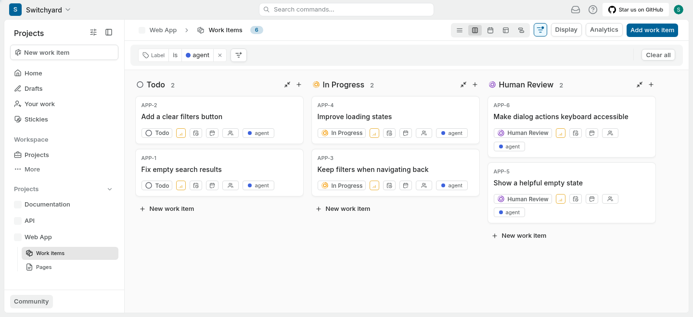
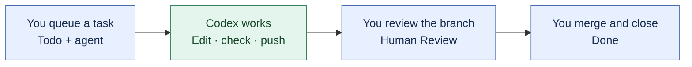

<div align="center">

# Switchyard

**Turn tasks on a board into reviewable code with Codex.**

Queue the work. Run it on your own machine. Review the result.

[Get started](docs/cli.md) · [How it works](#how-it-works) · [Operating guide](docs/operations.md) · [Contributing](CONTRIBUTING.md)

</div>



*A demo Plane board with tasks queued for Codex and ready for human review.*

## From “someone should fix this” to a branch you can review

Switchyard connects a task board to Codex. Write a bug fix, feature or cleanup
task in [Plane](https://plane.so), add the **agent** label, and move it to **Todo**.
Codex picks it up, works in a separate checkout, runs checks and pushes a branch.
The task returns to **Human Review** with a summary and check results.



- **Choose what runs.** Keep ideas in Backlog; dispatch the tasks that are ready.
- **Keep the context with the task.** Plans, progress, blockers and results live on the board.
- **Review before merging.** Each task gets its own checkout and branch. You decide what lands.
- **Keep your repositories on one board.** Connect each Plane project to the repository its tasks should work on.

## What would you give it?

Start with a small, independent task and a clear way to check the result. For example:

> **Fix search when the query is empty**
>
> An empty search should show all items instead of an error.
> Add a regression test and run the search tests.

The workflow asks Codex to post what changed, the checks it ran, the commit and a
link to the branch. If it gets stuck, it moves the task to **Blocked** with an
explanation. You can follow the board or open the live runner dashboard.

## Run it on your own machine

Start on a **private Linux x86-64 machine**. It can be the computer you use every
day, a spare machine or a server you access privately. The agent runs there;
your browser can be on the same computer or another one. Switchyard uses your
installed Codex, existing configuration and login.

Download the [latest Switchyard release](https://github.com/Kthom1/switchyard/releases/latest),
install the [Linux bundle on your PATH](docs/cli.md#install-on-your-path),
then run:

```bash
switchyard init
```

**[Follow the CLI setup guide →](docs/cli.md)**

`init` sets up the local Plane board, accounts and an unconnected starter project.
Use `project add` to connect each repository afterward. The guide
covers prerequisites, browser sign-in, connecting repositories and your first
task. Docker runs the board; the bundle includes the native Symphony runner
and its Elixir/Erlang runtime. The CLI requires a systemd user session.

SSH and Tailscale are optional ways to connect from another computer.
Contributors can [build the same CLI bundle from source](docs/getting-started.md).

Use trusted repositories and task authors. The services stay on loopback by
default; the runner dashboard has no login. See [private access](docs/operations.md#private-access).

## How it works

| Part | What it does |
| --- | --- |
| [Plane](https://github.com/makeplane/plane) | Your task board, descriptions, comments and review queue. |
| [OpenAI Symphony](https://github.com/openai/symphony) | Schedules runs, manages task checkouts and retries, and serves the live dashboard. |
| [Codex](https://developers.openai.com/codex/cli/) | Reads the task, edits code, runs checks and prepares a branch. |
| Switchyard | Connects Plane to Symphony, supplies the task workflow and sets up the local services. |

One installation runs one Plane board and one Symphony runner. Each connected
Plane project maps to one repository; its tasks get separate checkouts of that
repository. Add more projects with `switchyard project add --repo URL` and inspect
the connections with `switchyard project list`.

The default is **one agent at a time across all connected projects**. Tasks should
be independent; Plane's blocking relationships do not control the runner.

## Guides

| I want to… | Read |
| --- | --- |
| Install Switchyard and run my first task | [CLI setup](docs/cli.md) |
| Build Switchyard from source | [Source build](docs/getting-started.md) |
| Run in the background, connect remotely or stop a task | [Operating guide](docs/operations.md) |
| Add skills and plugins | [Recommended plugins and skills](docs/recommended.md) |
| Back up or recover an installation | [Backup and restore](docs/backup.md) |
| Change the integration and run its checks | [Contributing](CONTRIBUTING.md) |

## Credits and license

Built with [Plane](https://github.com/makeplane/plane) (AGPL-3.0) and
[OpenAI Symphony](https://github.com/openai/symphony) (Apache-2.0).
Symphony's [LICENSE](https://github.com/openai/symphony/blob/8001b52e3062495a16e520e4ceaf8f9de868c4d0/LICENSE) and [NOTICE](https://github.com/openai/symphony/blob/8001b52e3062495a16e520e4ceaf8f9de868c4d0/NOTICE)
are included with its source. Switchyard's integration and deployment files are
[AGPL-3.0](LICENSE). See [source and dependency versions](docs/provenance.md) for
the pinned sources, images and local patches.
